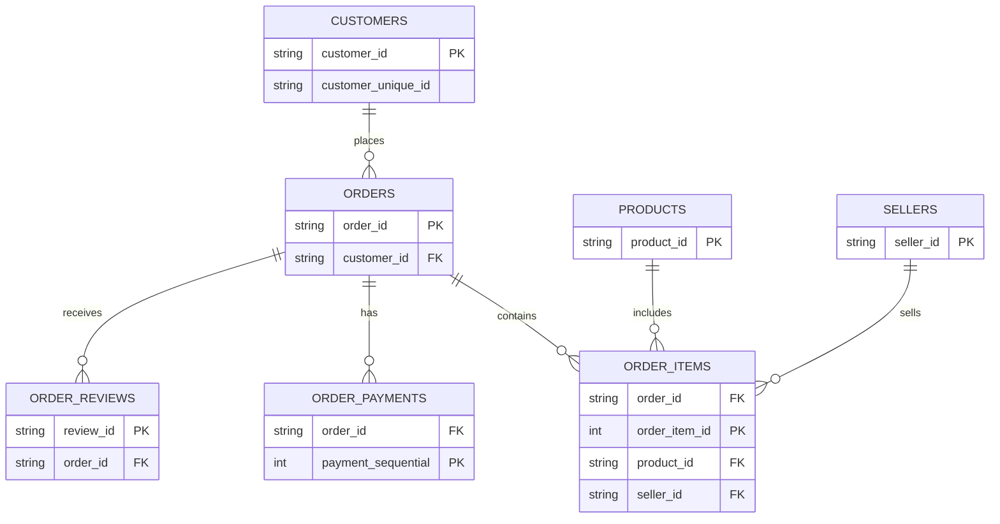
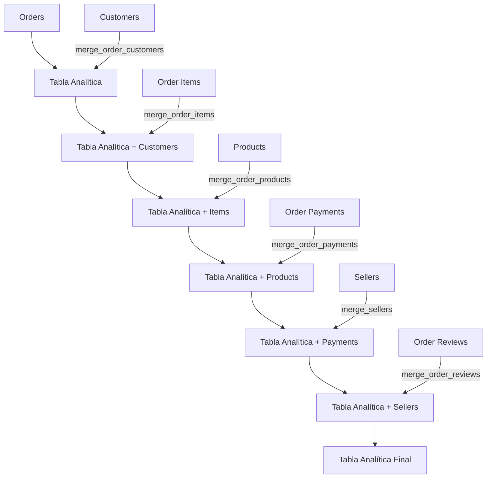

# Modelo de Datos - Olist

## Introducción

El proyecto utiliza el **Brazilian E-commerce Public Dataset by Olist** como fuente de datos.

Este documento describe las tablas utilizadas en el proyecto, sus relaciones, las claves primarias y foráneas, así como las principales características de cada una de ellas.

---
## Tablas del modelo

### Customers

#### Descripción

Contiene la información de los clientes.

#### ¿Qué representa una fila?

Representa un cliente registrado dentro de la plataforma.

#### Llave primaria (PK)

- `customer_id`

#### Llaves foráneas (FK)

Ninguna.

#### Relaciones

- Customers (1) → Orders (N), mediante `customer_id`.

#### Observaciones

- `customer_unique_id` identifica al cliente real.
- `customer_id` identifica al cliente dentro del contexto de una compra.
- Un mismo `customer_unique_id` puede aparecer asociado a varios `customer_id`.

---

### Orders

#### Descripción

Contiene la información de cada pedido realizado.

#### ¿Qué representa una fila?

Representa un pedido realizado por un cliente.

#### Llave primaria (PK)

- `order_id`

#### Llaves foráneas (FK)

- `customer_id` → `Customers.customer_id`

#### Relaciones

- Customers (1) → Orders (N).
- Orders (1) → Order Items (N).
- Orders (1) → Order Payments (N).
- Orders (1) → Order Reviews (N).

#### Observaciones

- Cada pedido pertenece a un único cliente.
- Un cliente puede realizar varios pedidos.
- La tabla almacena el estado del pedido y las fechas del proceso de compra.

---

### Order Items

#### Descripción

Contiene los productos incluidos en cada pedido.

#### ¿Qué representa una fila?

Representa un producto individual perteneciente a un pedido.

#### Llave primaria (PK)

- Llave compuesta: (`order_id`, `order_item_id`)

#### Llaves foráneas (FK)

- `order_id` → `Orders.order_id`
- `product_id` → `Products.product_id`
- `seller_id` → `Sellers.seller_id`

#### Relaciones

- Orders (1) → Order Items (N)
- Products (1) → Order Items (N)
- Sellers (1) → Order Items (N)

#### Observaciones

- Un pedido puede contener varios productos.
- Cada fila corresponde a un producto dentro de un pedido.
- Contiene el precio del producto.
- Contiene el valor del envío.
- Incluye la fecha límite de envío del vendedor.

---

### Products

#### Descripción

Contiene la información de los productos.

#### ¿Qué representa una fila?

Representa un producto del catálogo.

#### Llave primaria (PK)

- `product_id`

#### Llaves foráneas (FK)

Ninguna.

#### Relaciones

- Products (1) → Order Items (N)

#### Observaciones

- Contiene la categoría del producto.
- Incluye las dimensiones físicas del producto.
- Contiene información sobre el nombre y la descripción del producto.

---

### Order Payments

#### Descripción

Contiene la información del proceso de pago de un pedido.

#### ¿Qué representa una fila?

Representa un pago realizado para un pedido.

#### Llave primaria (PK)

- Llave compuesta: (`order_id`, `payment_sequential`)

#### Llaves foráneas (FK)

- `order_id` → `Orders.order_id`

#### Relaciones

- Orders (1) → Order Payments (N)

#### Observaciones

- Un pedido puede tener uno o varios pagos.
- Contiene el método de pago utilizado.
- Incluye el número de cuotas (`payment_installments`).
- Registra el valor pagado (`payment_value`).

---

### Sellers

#### Descripción

Contiene la información de los vendedores.

#### ¿Qué representa una fila?

Representa un vendedor registrado en la plataforma.

#### Llave primaria (PK)

- `seller_id`

#### Llaves foráneas (FK)

Ninguna.

#### Relaciones

- Sellers (1) → Order Items (N)

#### Observaciones

- Contiene el código postal del vendedor.
- Incluye la ciudad y el estado del vendedor.

---

### Order Reviews

#### Descripción

Contiene las reseñas realizadas por los clientes sobre sus pedidos.

#### ¿Qué representa una fila?

Representa una reseña asociada a un pedido.

#### Llave primaria (PK)

- `review_id`

#### Llaves foráneas (FK)

- `order_id` → `Orders.order_id`

#### Relaciones

- Orders (1) → Order Reviews (N)

#### Observaciones

- Un pedido puede tener múltiples reseñas (actualizaciones o seguimientos).
- `review_score` toma valores entre 1 y 5.
- Muchas reseñas no contienen comentario de texto.

---
## 2. Diagrama ER

## 3. Diagrama Pipeline 

